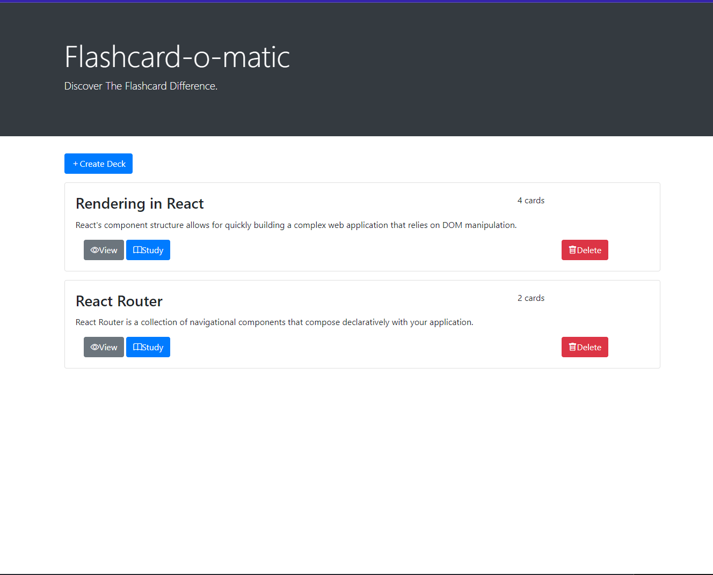

# project-flashcards
Thinkful Flashcard App

Project: Flashcard-o-matic
A local school has decided to put together a flashcard application, 
Flashcard-o-matic, to help their students study online. Teachers will use this application to create decks of flashcards for the subjects they teach, 
and students will study the decks. The school needs you to build the application that the students and teachers will use.

Here is an image of my own home page: 

This project is designed to test your ability to work with rendering and state management using React. Before taking on this module, 
you should be comfortable with the following:

Installing packages via NPM
Running tests from the command line
Writing React function components
Creating routes, including nested routes, using React Router
Using hooks like useState(), useParams(), and useHistory()
Debugging React code through console output and using the VS Code debugger

API
There are two datasets that are a part of this project: decks and cards.

The following is a partial listing of the data in data/db.json:

{
  "decks": [
    {
      "id": 1,
      "name": "...",
      "description": "..."
    }
  ],
  "cards": [
    {
      "id": 1,
      "front": "...",
      "back": "...",
      "deckId": 1
    }
  ]
}
